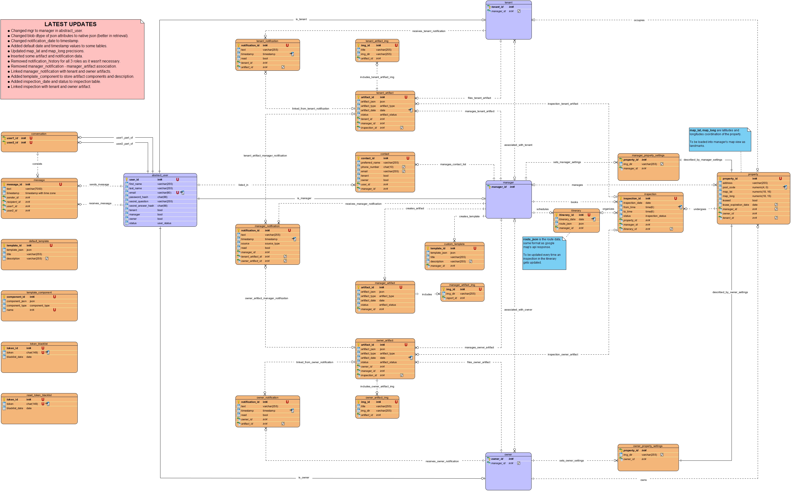

## Database

This script will download and install all necessary packages and generate a PostgreSQL database called 'pmsdb', superuser: 'admin', password: 'bigai' and populate with 3 test users, one for each role.

### First time initialization: 
**Download the directory and run the following commands in a terminal:** 
`chmod u+x db_init` 
`./db_init` 

**If using WSL, run the following commands in a terminal (This will not install pgAdmin4):** 
`chmod u+x db_init_WSL` 
`./db_init_WSL` 

Follow the instructions and type 'y' when prompted.

The last step will require you to enter an email and a password. This is for pgAdmin4 (a graphical management tool for PostgreSQL databases), not for the database.

When finished, open your internet browser and go to http://127.0.0.1/pgadmin4/

1. Enter your email and password.
2. Click on 'Add New Server'.
3. Under 'General': put the name whatever you want (ex. PMS).
4. Under 'Connection': Host=localhost, Port=5432, Username=admin, Password=bigai
5. Check Save Password.
6. Save.

Now you are in.
On the left panel, expand the server  'PMS' -> Databases -> pmsdb -> Schemas -> public -> Tables -> right click on abstractuser -> View/Edit Data -> All Rows. 
You should now be able to see the 3 test users.

**To connect to the database from terminal using psql, run the following command and enter the password '*bigai*' when prompted:** 
`psql -h 127.0.0.1 -p 5432 -d pmsdb -U admin`

### Updating existing database: 
db_create will perform the same as db_init except it won't update system or install any additional packages. 
**Run the following commands:** 
`chmod u+x db_create` 
`./db_create` 

**ENUM datatypes:** 
You will find them at the top of the ddl file. 
* user_status ('offline', 'online_tenant', 'online_manager', 'online_owner') 
* artifact_status('approved_by_owner',
                  'approved_by_manager',
                  'denied_by_owner',
                  'denied_by_manager',
                  'approved_by_tenant',
                  'denied_by_tenant',
                  'pending',
                  'fulfilled',
                  'scheduled',
                  'canceled',
                  'reschedule',
                  'rescheduled',
                  'archived');)               
* artifact_type(  'report_received', 
                  'report_due',
                  'request_repair',
                  'request_lease_extension',
                  'request_reschedule',
                  'request_listing',
                  'request_unlisting',
                  'notice_eviction',
                  'notice_leave',
                  'inspection',
                  'connection_from_tenant',
                  'connection_from_manager',
                  'connection_from_owner')          
* inspection_status('scheduled', 'rescheduled', 'canceled', 'complete') 
* source_type('tenant', 'owner', 'system') 
* component_type( 'text_small',
                  'text_large',
                  'checkbox',
                  'dropdown',
                  'datepicker',
                  'options',
                  'scale_3',
                  'scale_5',
                  'scale_7') 
* [Not used now] secret_question (
    - 'What is your favorite book?',
    - 'What is the name of the road you grew up on?',
    - 'What is your mother’s maiden name?',
    - 'What was the name of your first/current/favorite pet?',
    - 'What was the first company that you worked for?',
    - 'Where did you meet your spouse?',
    - 'Where did you go to high school/college?',
    - 'What is your favorite food?',
    - 'What city were you born in?',
    - 'Where is your favorite place to vacation?') 

### Test users included: 
**Test User 1:** 
* first_name = 'test'
* last_name = 'tenant'
* email = 'tenant@gmail.com'
* password = '123'
* tenant = TRUE
* manager = FALSE
* owner = FALSE
* secret_question = 'What Is your favorite book?'
* secret_answer = 'The Catcher in the Rye'
* user_status = 'offline'

**Test User 2:** 
* first_name = 'test'
* last_name = 'manager'
* email = 'manager@gmail.com'
* password = '123'
* tenant = FALSE
* manager = TRUE
* owner = FALSE
* secret_question = 'What Is your favorite book?'
* secret_answer = 'The Catcher in the Rye'
* user_status = 'offline'

**Test User 3:** 
* first_name = 'test'
* last_name = 'owner'
* email = 'owner@gmail.com'
* password = '123'
* tenant = FALSE
* manager = FALSE
* owner = TRUE
* secret_question = 'What Is your favorite book?'
* secret_answer = 'The Catcher in the Rye'
* user_status = 'offline'

Refer to the following ER Diagram to understand the structure.

